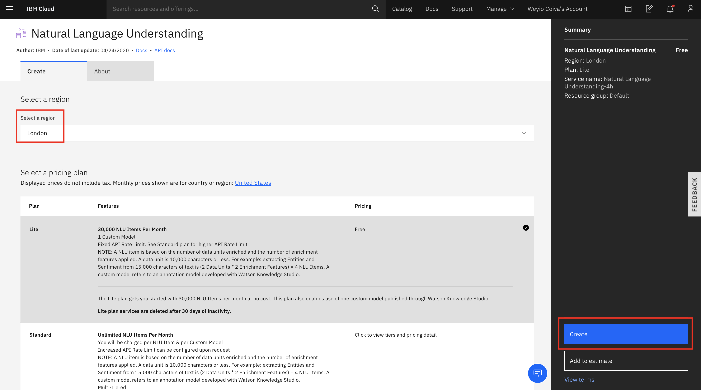
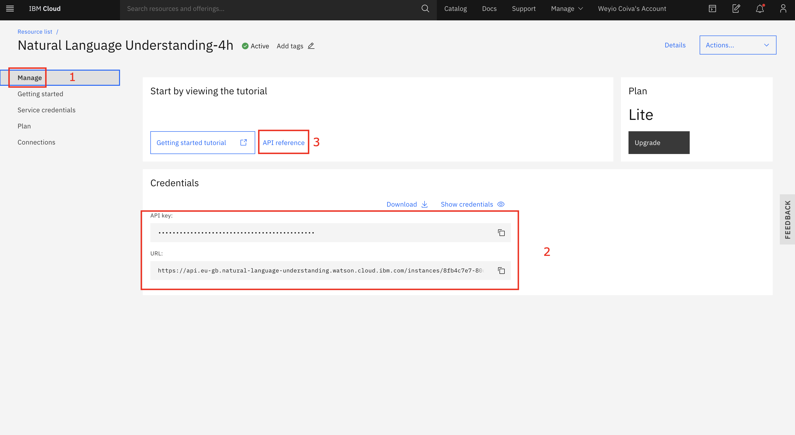
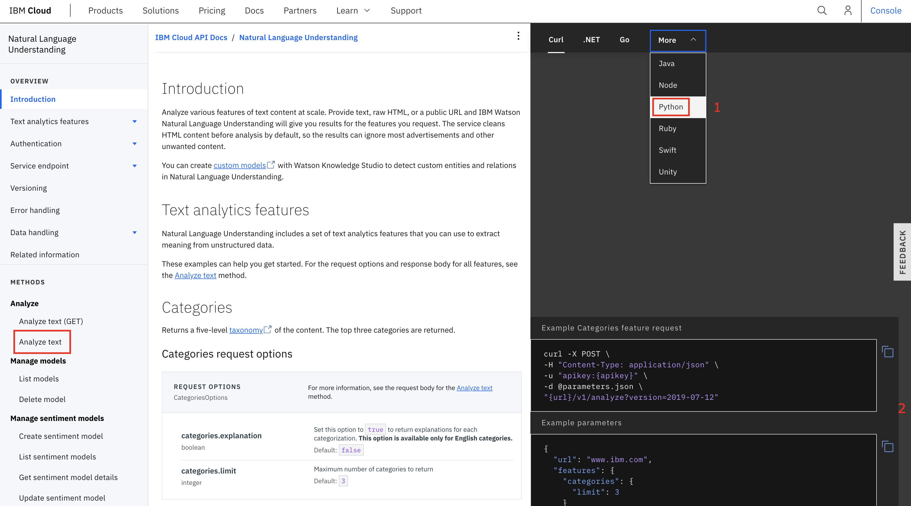
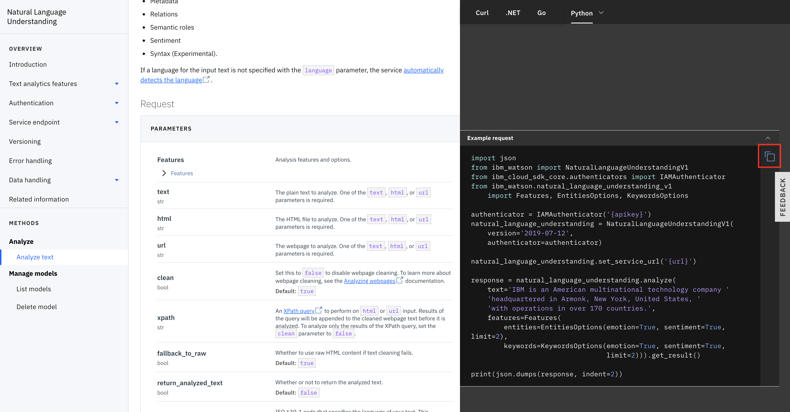
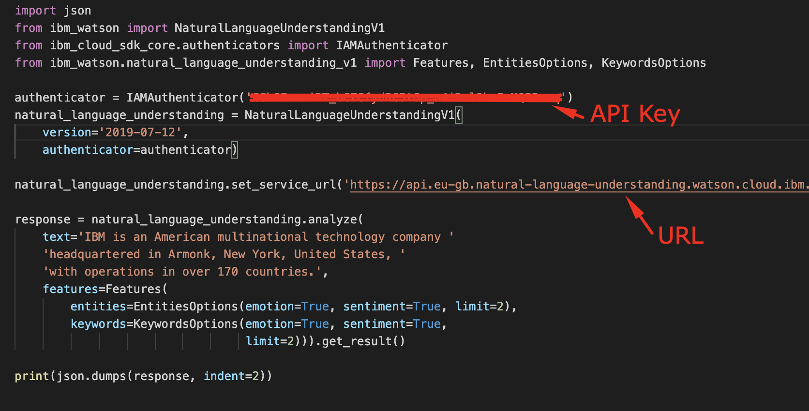
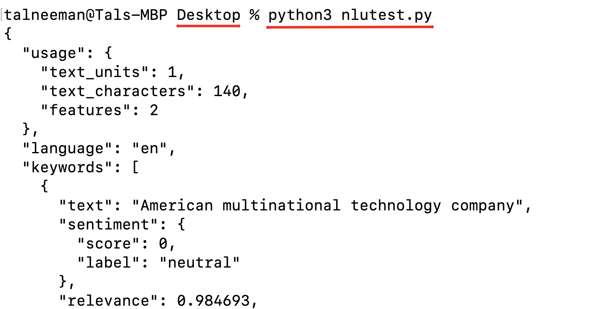

# Hands-on workshop tutorial

## Prerequisites

1) Register to IBM Cloud - https://ibm.biz/BdqfUZ
2) Install python 3.5+ - https://www.python.org/downloads/
3) Install Watson python SKD:
```
pip install --upgrade "ibm-watson>=4.4.0"
```

### Step 1 - create Natural Language Service

Go to the [NLU service creation page](https://cloud.ibm.com/catalog/services/natural-language-understanding)

Select region "London" and click "Create".


### Step 2 - get credentials to use the service

Select "Manage", copy the API Key and URL to use later on this demo and select the "API Reference".


### Step 3 - get code example and execute the request

Select the "Python" language from the drop down list (if you prefer other language feel free to select it), click on the "Analyze text".


Copy the example code.


Create a file on your desktop with the name "nlutest.py" and open it with your favorite IDE for python (or just use notepad++).

Paste you API Key and URL in the code example.


Open your terminal and execute the file and see the results.


### Step 4 - understand the results

To read more about the features of this services and all other related contect go to this link: https://cloud.ibm.com/docs/services/natural-language-understanding

# Services Demo

https://www.ibm.com/demos/live/natural-language-understanding/self-service/home

https://www.ibm.com/demos/live/watson-knowledge-studio/self-service/home

https://www.ibm.com/demos/live/discovery-expert-assist/self-service/home

# Watson Services

Discovery : https://cloud.ibm.com/catalog/services/discovery

Natural Language Understanding : https://cloud.ibm.com/catalog/services/natural-language-understanding

Knowledge Studio : https://cloud.ibm.com/catalog/services/knowledge-studio

# Call for Code links

Website: https://developer.ibm.com/callforcode/

Global Git: https://github.com/Call-For-Code

# Have questions ?

Find me on Linkein: https://www.linkedin.com/in/tal-neeman-326536101/

# Want more hands-on workshops?

Meetup group: https://www.meetup.com/IBM-Startup-Developer-Tel-Aviv/